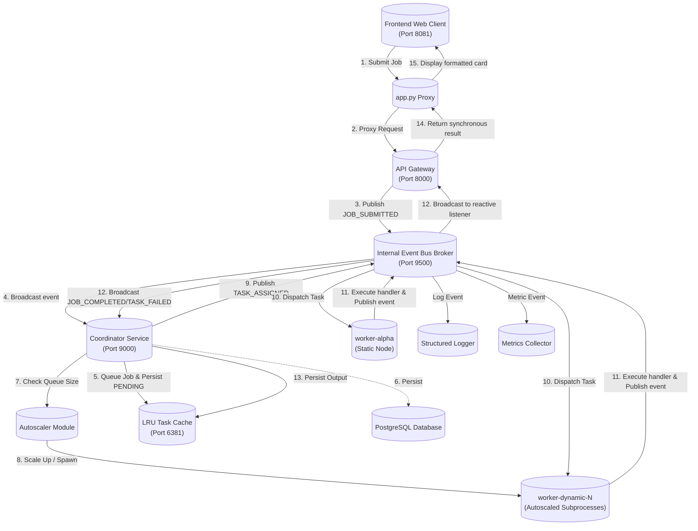

# Event-Driven Distributed Job Processing System (Zero Application Framework)

Event-driven distributed job processing system implemented in Python without external application frameworks. The architecture coordinates tasks, manages dynamic worker autoscaling, and executes cryptographic security workloads reactively.

---

## Architectural Flow

---

## Core Components

1.  **Frontend Workload Dispatcher (Port 8081)**:
    A threaded proxy client that presents an interactive web interface to choose and submit jobs (Password Leak Audit, MFA TOTP Verifier, Signature Verifier) along with their priorities and custom parameters.
2.  **API Gateway (Port 8000)**:
    Accepts HTTP connections, authenticates requests, publishes job submissions to the internal event bus, and uses a reactive socket listener thread to block and return completion results synchronously.
3.  **Internal Event Bus (Port 9500)**:
    A lightweight, standalone pub-sub broker that manages subscription state and distributes framed, line-delimited TCP packets across system modules.
4.  **Coordinator Service (Port 9000)**:
    Maintains scheduling priorities, registers active workers, heartbeat states, and runs the background **Autoscaler** thread loop.
5.  **Autoscaling Daemon**:
    Spins up dynamic worker subprocesses (`worker-dynamic-N`) during high backlog conditions, and gently terminates them once tasks are drained and idle.
6.  **Event-Driven Workers**:
    Thread-pool executors that connect to the coordinator, accept task assignments, run cryptographic operations (e.g. SHA-1 hashes, RFC 6238 TOTP validation, or Ed25519 asymmetric signature checks), and report results.
7.  **Telemetry & Logging**:
    *   **Metrics Collector**: Tracks alive workers, queue depth, latencies, and failures in a thread-safe telemetry cache.
    *   **Structured Logger**: Outputs JSON records with ISO 8601 formatting, correlation/trace IDs, log level filters, and Rotating File handlers.

---

